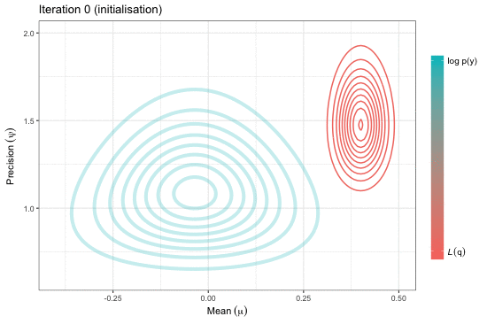

```{r setup, include=FALSE}
knitr::opts_chunk$set(echo = TRUE, prompt = TRUE)
options(prompt = "R> ")

# Load external .R file
knitr::read_chunk("01-prelim.R")
knitr::read_chunk("07-cardiac.R")
knitr::read_chunk("08-smoking.R")
```
```{r prelim, include = FALSE}
```

## Abstract

An extension of the I-prior methodology to binary response data is explored. Starting from a latent variable approach, it is assumed that  there exists continuous, auxiliary random variables which decide the outcome of the binary responses. Modelling these latent variables using an ordinary linear model with normally distributed errors leads to the well-known generalised linear model with a probit link. Instead, a more general regression approach is considered in which an I-prior on the regression function, which lies in some reproducing kernel Hilbert space, is assumed. An I-prior distribution is Gaussian with mean chosen a priori, and covariance equal to the Fisher information for the regression function. By doing so, the benefits of the original I-prior methodology is brought over to the binary case - one of which is providing a unified model fitting methodology that includes additive models, multilevel models and models with one or more functional covariates. The challenge is in the estimation, and a variational approximation is employed to overcome the intractable likelihood. Several real-world examples are presented from analyses conducted in `R`.

*Keywords*: binary, probit, regression, kernel, RKHS, Gaussian, process, multilevel, longitudinal, functional, prior, variational, Bayes, EM

## Links

- Presentation slides - PDF *[link to appear]*
- Source code - [GitHub](https://github.com/haziqjamil/phd-presentation-3)
- R/iprior package - [CRAN](https://cran.r-project.org/package=iprior), [GitHub](https://github.com/haziqjamil/iprior)
- R/iprobit package - [GitHub](https://github.com/haziqjamil/iprobit)

## Supplementary material

### Variational inference for Gaussian mean and precision



### Cardiac arrhythmia data set 

#### Results of experiments

```{r sim.res.cardiac, echo = FALSE}
```

#### Plot of results

```{r plot.readme.cardiac, echo = FALSE, fig.height = 4, fig.width = 5.5}
```

### Meta-analysis of smoking cessation 

#### Model comparison

```{r data.smoke, include = FALSE}
```

```{r fit.smoke, include = FALSE}
```

```{r mod.compare.smoke, include = FALSE}
```

```{r mod.compare.smoke.md, echo = FALSE}
colnames(tab.compare)[4] <- "No. of RKHS param."
knitr::kable(tab.compare, align = c("l", "r", "r", "r"))
```

*Notes: The [Brier score](https://en.wikipedia.org/wiki/Brier_score) measures the accuracy of probabilistic predictions.*

#### Model predicted odds (with naive interval)

```{r tab.smoke.all, echo = FALSE}
```

#### Plot of model predicted odds

```{r plot.smoke.all, echo = FALSE, fig.height = 10, fig.width = 6}
```

Copyright (C) 2017 [Haziq Jamil](http://haziqj.ml). All rights reserved.

```{r move, include = FALSE}
file.copy("README.md", "../README.md", overwrite = TRUE)
files <- list.files("README_files/figure-markdown_github")
if (!dir.exists("../README_files/figure-markdown_github")) {
  dir.create("../README_files/")
  dir.create("../README_files/figure-markdown_github")
}
file.copy("README_files/", "../", recursive = TRUE)
```
