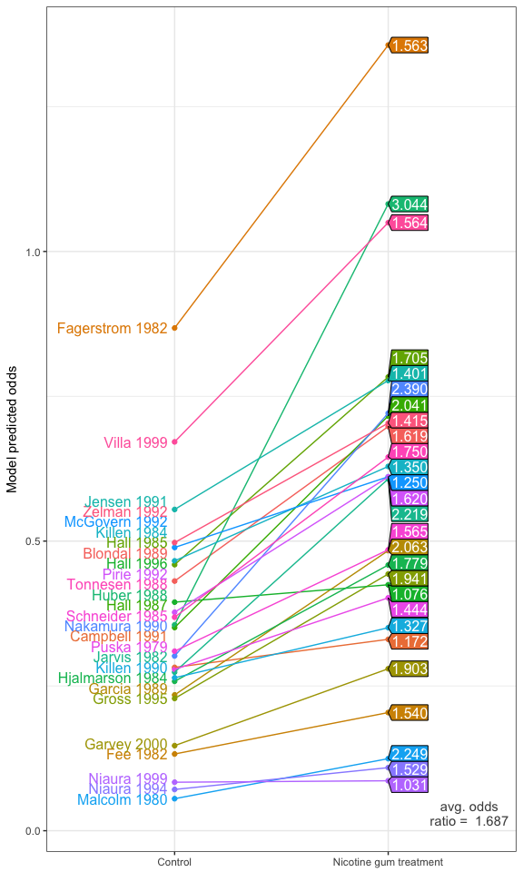
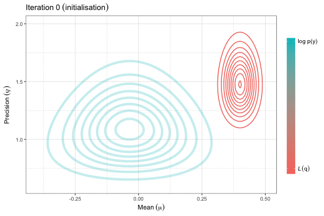

Abstract
--------

An extension of the I-prior methodology to binary response data is explored. Starting from a latent variable approach, it is assumed that there exists continuous, auxiliary random variables which decide the outcome of the binary responses. Fitting a classical linear regression model on these latent variables while assuming normality of the error terms leads to the well-known generalised linear model with a probit link. A more general regression approach is considered instead, in which an I-prior on the regression function, which lies in some reproducing kernel Hilbert space, is assumed. An I-prior distribution is Gaussian with mean chosen a priori, and covariance equal to the Fisher information for the regression function. By working with I-priors, the benefits of the methodology are brought over to the binary case - one of which is that it provides a unified model-fitting framework that includes additive models, multilevel models and models with one or more functional covariates. The challenge is in the estimation, and a variational approximation is employed to overcome the intractable likelihood. Several real-world examples are presented from analyses conducted in `R`.

*Keywords*: binary, probit, regression, kernel, RKHS, Gaussian, process, multilevel, longitudinal, functional, prior, variational, Bayes, EM

Links
-----

-   Presentation slides - [PDF](https://github.com/haziqjamil/phd-presentation-3/blob/master/phd-presentation-3-handout.pdf)
-   Source code - [GitHub](https://github.com/haziqjamil/phd-presentation-3)
-   R/iprior package - [CRAN](https://cran.r-project.org/package=iprior), [GitHub](https://github.com/haziqjamil/iprior)
-   R/iprobit package - [GitHub](https://github.com/haziqjamil/iprobit)

Supplementary material
----------------------

### Cardiac arrhythmia data set

#### Results of experiments

|                    |        n = 50|       n = 100|       n = 200|  Rank|
|--------------------|-------------:|-------------:|-------------:|-----:|
| I-probit (linear)  |  40.13 (0.58)|  32.71 (0.43)|  26.53 (0.27)|     4|
| I-probit (FBM-0.5) |  35.08 (0.64)|  28.93 (0.29)|  26.79 (0.23)|     2|
| k-nn               |  40.64 (0.33)|  38.94 (0.33)|  35.76 (0.36)|     8|
| SVM                |  36.16 (0.47)|  35.64 (0.39)|  35.20 (0.35)|     7|
| GP (radial)        |  37.28 (0.42)|  33.80 (0.40)|  29.31 (0.35)|     5|
| Random forests     |  31.65 (0.39)|  26.72 (0.29)|  22.40 (0.31)|     1|
| NSC                |  34.98 (0.46)|  33.00 (0.44)|  31.08 (0.41)|     6|
| L-1 logistic       |  34.92 (0.42)|  30.48 (0.34)|  26.12 (0.27)|     3|

#### Plot of results

### Meta-analysis of smoking cessation

#### Model comparison

|     | Model                                                |  Lower bound|  Brier score|  No. of RKHS param.|
|-----|:-----------------------------------------------------|------------:|------------:|-------------------:|
| 1   | *f*1                                      |     -3210.79|       0.0311|                   1|
| 2   | *f*1 + *f*2                    |     -3097.24|       0.0294|                   2|
| 3   | *f*1 + *f*2 + *f*12 |     -3091.21|       0.0294|                   2|

*Notes: The [Brier score](https://en.wikipedia.org/wiki/Brier_score) measures the accuracy of probabilistic predictions.*

#### Model predicted odds (with naive 95% credibility interval)

| Study           |            Control|            Treated|         Odds ratio|
|:----------------|------------------:|------------------:|------------------:|
| Blondal 1989    |  0.43 (0.25, 0.58)|  0.70 (0.45, 1.01)|  1.62 (0.77, 4.10)|
| Campbell 1991   |  0.28 (0.17, 0.38)|  0.33 (0.17, 0.42)|  1.17 (0.44, 2.54)|
| Fagerstrom 1982 |  0.87 (0.57, 1.29)|  1.36 (0.96, 2.20)|  1.56 (0.74, 3.88)|
| Fee 1982        |  0.13 (0.06, 0.17)|  0.20 (0.10, 0.26)|  1.54 (0.60, 3.99)|
| Garcia 1989     |  0.23 (0.11, 0.29)|  0.48 (0.30, 0.68)|  2.06 (1.04, 6.44)|
| Garvey 2000     |  0.15 (0.06, 0.18)|  0.28 (0.15, 0.37)|  1.90 (0.87, 5.88)|
| Gross 1995      |  0.23 (0.10, 0.28)|  0.44 (0.26, 0.61)|  1.94 (0.94, 5.87)|
| Hall 1985       |  0.46 (0.26, 0.62)|  0.78 (0.51, 1.16)|  1.71 (0.83, 4.43)|
| Hall 1987       |  0.35 (0.18, 0.45)|  0.72 (0.48, 1.07)|  2.04 (1.06, 5.95)|
| Hall 1996       |  0.39 (0.25, 0.55)|  0.42 (0.23, 0.55)|  1.08 (0.41, 2.25)|
| Hjalmarson 1984 |  0.26 (0.13, 0.33)|  0.46 (0.28, 0.64)|  1.78 (0.84, 4.87)|
| Huber 1988      |  0.36 (0.16, 0.44)|  1.08 (0.80, 1.86)|  3.04 (1.83, 11.6)|
| Jarvis 1982     |  0.27 (0.13, 0.34)|  0.61 (0.40, 0.89)|  2.22 (1.17, 6.98)|
| Jensen 1991     |  0.55 (0.35, 0.79)|  0.78 (0.50, 1.13)|  1.40 (0.63, 3.27)|
| Killen 1984     |  0.47 (0.29, 0.65)|  0.63 (0.39, 0.89)|  1.35 (0.59, 3.10)|
| Killen 1990     |  0.26 (0.15, 0.35)|  0.35 (0.19, 0.46)|  1.33 (0.54, 3.07)|
| Malcolm 1980    |  0.06 (0.02, 0.06)|  0.12 (0.06, 0.15)|  2.25 (0.97, 9.11)|
| McGovern 1992   |  0.49 (0.31, 0.69)|  0.61 (0.37, 0.85)|  1.25 (0.53, 2.78)|
| Nakamura 1990   |  0.30 (0.14, 0.37)|  0.72 (0.49, 1.10)|  2.39 (1.31, 7.82)|
| Niaura 1994     |  0.07 (0.03, 0.09)|  0.11 (0.04, 0.13)|  1.53 (0.50, 4.12)|
| Niaura 1999     |  0.08 (0.05, 0.11)|  0.09 (0.02, 0.09)|  1.03 (0.21, 2.09)|
| Pirie 1992      |  0.38 (0.21, 0.50)|  0.61 (0.38, 0.87)|  1.62 (0.76, 4.12)|
| Puska 1979      |  0.28 (0.15, 0.37)|  0.40 (0.23, 0.54)|  1.44 (0.62, 3.49)|
| Schneider 1985  |  0.31 (0.17, 0.41)|  0.49 (0.29, 0.67)|  1.56 (0.71, 3.94)|
| Tonnesen 1988   |  0.37 (0.20, 0.48)|  0.65 (0.41, 0.93)|  1.75 (0.85, 4.65)|
| Villa 1999      |  0.67 (0.42, 0.96)|  1.05 (0.72, 1.63)|  1.56 (0.75, 3.87)|
| Zelman 1992     |  0.50 (0.30, 0.69)|  0.70 (0.44, 1.01)|  1.41 (0.64, 3.34)|

#### Plot of model predicted odds

### Variational inference for Gaussian mean and precision

Adapted from pp.36-37 of the presentation.

 <!--  -->

------------------------------------------------------------------------

Copyright (C) 2017 [Haziq Jamil](http://haziqj.ml). All rights reserved.
